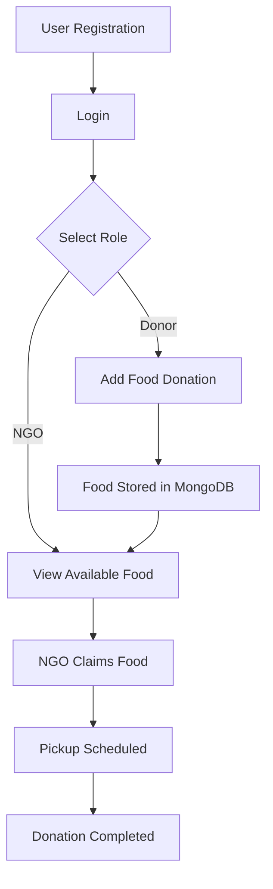

# WasteNot – Food Surplus Donation Platform

WasteNot is a MERN-based web application designed to reduce food waste by 
connecting food donors (restaurants, households, events) with NGOs that 
can redistribute surplus food to people in need.

