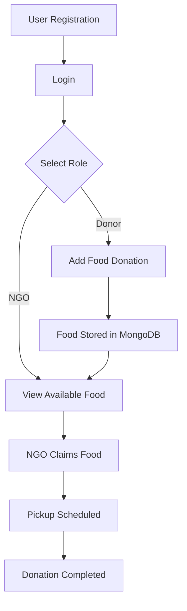

# SaveBite – Food Surplus Donation Platform

WasteNot is a MERN-based web application designed to reduce food waste by 
connecting food donors (restaurants, households, events) with NGOs that 
can redistribute surplus food to people in need.
## Problem Statement

Large amounts of food are wasted daily while many people struggle with hunger.
Restaurants, events, and households often have surplus food but lack a simple 
way to donate it.

This project aims to create a platform that efficiently connects food donors 
with NGOs that can collect and distribute food to those in need.
## Solution

SaveBite provides a platform where:

- Donors can list surplus food
- NGOs can view nearby food donations
- NGOs can claim food and schedule pickup
- Admins can monitor and manage the system

